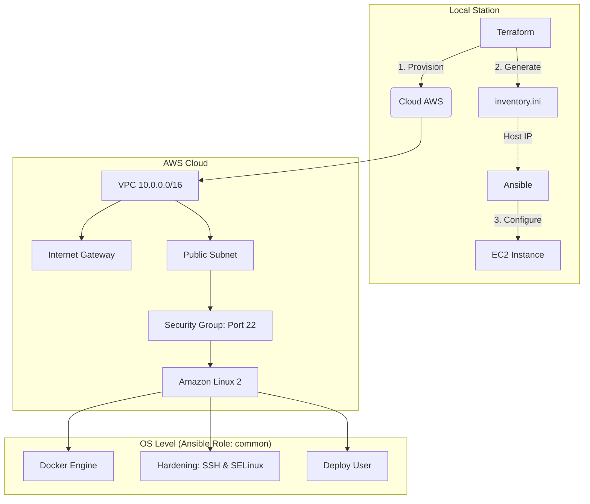

# 🏗️ Lab 1: Automação de Infraestrutura Híbrida (AWS + Ansible)

## 📌 Visão Geral

Este laboratório demonstra a implementação de uma infraestrutura moderna seguindo o modelo de **Infrastructure as Code (IaC)** e **Configuration Management**.

O objetivo é provisionar um servidor de aplicação na AWS utilizando Terraform e configurá-lo de forma automática e idempotente com Ansible, simulando um ambiente de missão crítica.

> **Cenário:** Integração de recursos Cloud com padrões de segurança governamentais (DTIC), garantindo que a configuração do servidor seja auditável, resiliente e replicável.

---

## 📐 Arquitetura da Solução



---

## 🛠️ Tecnologias Utilizadas

- **Terraform (v1.5+)** → Provisionamento de infraestrutura escalável
- **Ansible (v2.10+)** → Gerenciamento de configuração e hardening de SO
- **AWS Provider (~> 6.0)** → Serviços de computação e rede
- **Mermaid.js** → Documentação de arquitetura como código

---

## 🛡️ Decisões de Engenharia & Boas Práticas

### 1. Camada de Infraestrutura (Terraform)

- **AMI Dinâmica**
  Utilização de data sources para buscar a AMI mais recente do Amazon Linux 2, evitando falhas por IDs obsoletos.

- **Segurança (Least Privilege)**
  Security Group restrito via variável `my_ip`, com validação de formato CIDR usando Regex no `variables.tf`.

- **Integração Nativa**
  Geração automática do arquivo `inventory.ini` via recurso `local_file`, eliminando erros manuais.

---

### 2. Camada de Configuração (Ansible)

- **Modularização por Roles**
  Estrutura organizada em `roles/common`, facilitando manutenção e reuso.

- **Hardening de SO**
  - Desabilitação de login root via SSH
  - Configuração de firewall (SSH only)

- **Idempotência e Handlers**
  Uso de `notify` para reiniciar serviços apenas quando necessário.

- **SELinux Permissive**
  Mantém auditoria ativa sem comprometer compatibilidade com Docker.

---

## 🚀 Como Executar

### 🔧 Pré-requisitos

- AWS CLI configurado com credenciais válidas
- Chave SSH (`.pem`) cadastrada na AWS
- Ferramentas de qualidade:
  - `tflint`
  - `ansible-lint`

---

### 📦 Passo 1: Provisionamento (Terraform)

```bash
cd terraform

terraform init

terraform plan \
  -var="key_name=sua-chave" \
  -var="my_ip=SEU_IP/32"

terraform apply -auto-approve \
  -var="key_name=sua-chave" \
  -var="my_ip=SEU_IP/32"
```

---

### ⚙️ Passo 2: Configuração (Ansible)

O Terraform irá gerar automaticamente o arquivo de inventário.

```bash
cd ..

ansible-playbook \
  -i ansible/inventory.ini \
  -u ec2-user \
  --private-key sua-chave.pem \
  ansible/playbook.yml
```

---

## 🔍 Troubleshooting

| Sintoma                        | Causa Provável                                  | Solução                     |
|--------------------------------|--------------------------------------------------|-----------------------------|
| No configuration files         | Executado fora da pasta `/terraform`            | Use `cd terraform`          |
| SSH Timeout no Ansible         | Security Group ou instância inicializando       | Verifique IP em `my_ip`     |
| Permission Denied (publickey)  | Problema com chave `.pem`                       | `chmod 400 chave.pem`       |
| Erros SELinux no Docker        | Contexto bloqueando volumes                     | Verifique com `getenforce`  |

---

## 👨‍💻 Autor

**Ícaro Barros**
Engenheiro de Computação & Solutions Architect
