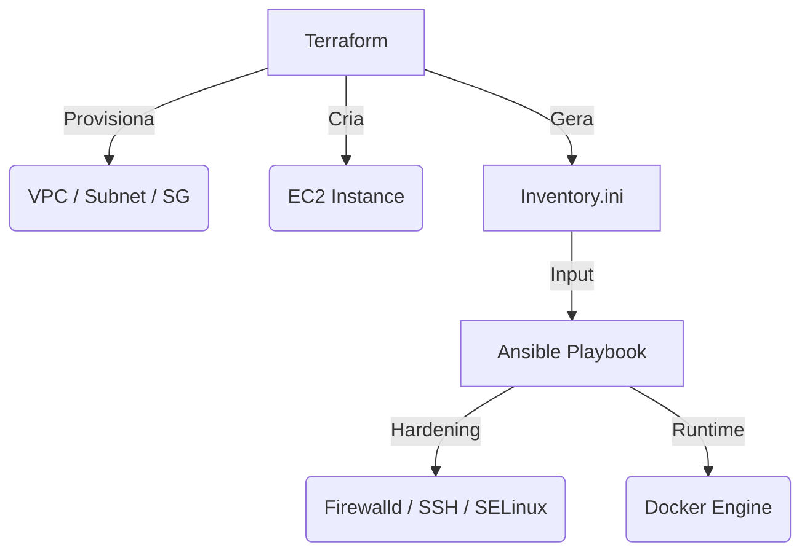

# Lab: Automação de Infraestrutura Híbrida (Terraform + Ansible)

Este repositório contém um laboratório completo de **Infrastructure as Code (IaC)** e **Configuration Management**. O objetivo é provisionar uma infraestrutura segura na AWS utilizando Terraform e automatizar o hardening do sistema operacional e a instalação do Docker via Ansible.

---

## 🏗️ Arquitetura do Projeto

O projeto segue o fluxo moderno de entrega de infraestrutura:

1. **Terraform:** Provisiona a rede (VPC, Subnet, IGW), Security Groups e a instância EC2 (t3.micro) usando Data Sources para buscar a AMI oficial do Amazon Linux 2.  
2. **Ansible:** Realiza o "post-provisioning", aplicando regras de firewall, desabilitando acessos inseguros e preparando o runtime de containers.



---

## 🛠️ Tecnologias Utilizadas

- **Cloud:** AWS (EC2, VPC, Security Groups)  
- **IaC:** Terraform v1.x  
- **Configuration Management:** Ansible v2.16+  
- **SO:** Amazon Linux 2 (RHEL based)  
- **Ambiente de Execução:** WSL2 (Ubuntu) / Git Bash  

---

## 🔐 Diferenciais de Segurança (Hardening)

Diferente de setups básicos, este laboratório aplica práticas recomendadas de segurança:

- **Least Privilege:** Criação de usuário de deploy dedicado com acesso restrito ao Docker socket  
- **Firewall Ativo:** Configuração do firewalld para permitir estritamente o tráfego SSH  
- **SSH Hardening:** Desabilitação do login via usuário root  
- **SELinux:** Garantia de conformidade com políticas de controle de acesso  

---

## 📸 Demonstração de Resultados

Abaixo, as evidências da execução bem-sucedida do ciclo de vida da infraestrutura:

### 1. Provisionamento com Terraform
Execução do `terraform apply` demonstrando a criação dinâmica de recursos e a exposição de outputs técnicos.

### 2. Validação no Console AWS
Confirmação da instância provisionada com as tags e configurações de hardware definidas via código.

### 3. Configuração com Ansible
Execução do playbook demonstrando a idempotência das tarefas e o sucesso no setup de segurança.

### 4. Validação Interna do Servidor
Verificação manual do status do firewall, Docker Engine e políticas de segurança após o deploy.

---

## 🚀 Como Executar

### Pré-requisitos

- AWS CLI configurado com credenciais válidas  
- Terraform e Ansible instalados no seu ambiente (preferencialmente WSL2)  

---

### Passo 1: Infraestrutura

```bash
cd terraform
terraform init
terraform apply -var="key_name=sua-chave" -var="my_ip=$(curl -s http://checkip.amazonaws.com)/32"
```

---

### Passo 2: Configuração

```bash
cd ../ansible
ansible-playbook -i inventory.ini -u ec2-user --private-key "~/sua-chave.pem" playbook.yml
```

---

## 👨‍💻 Autor

**Ícaro Januário**  
Engenheiro de Computação | Cloud & DevOps
